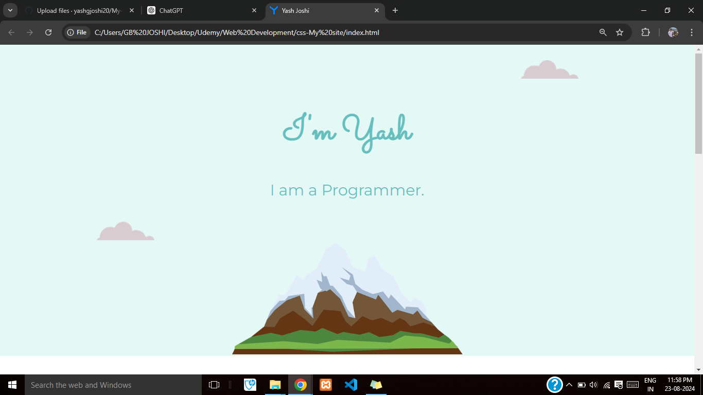
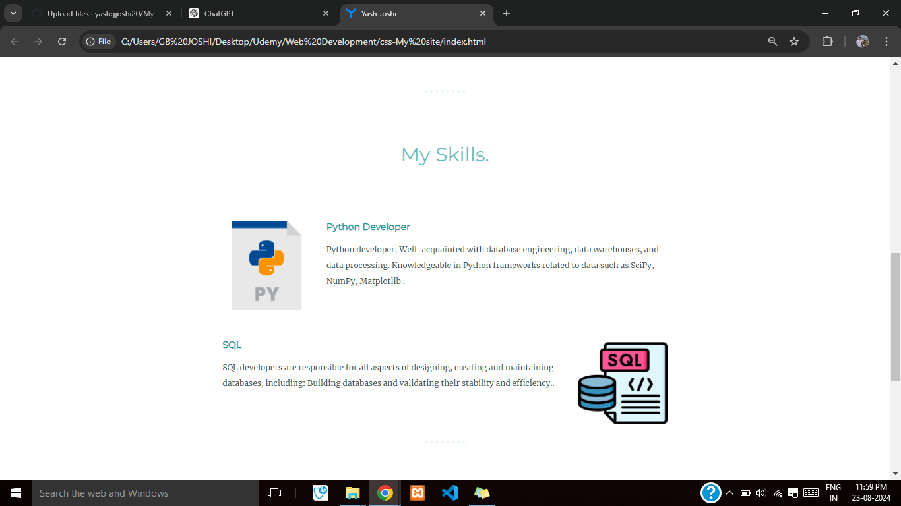
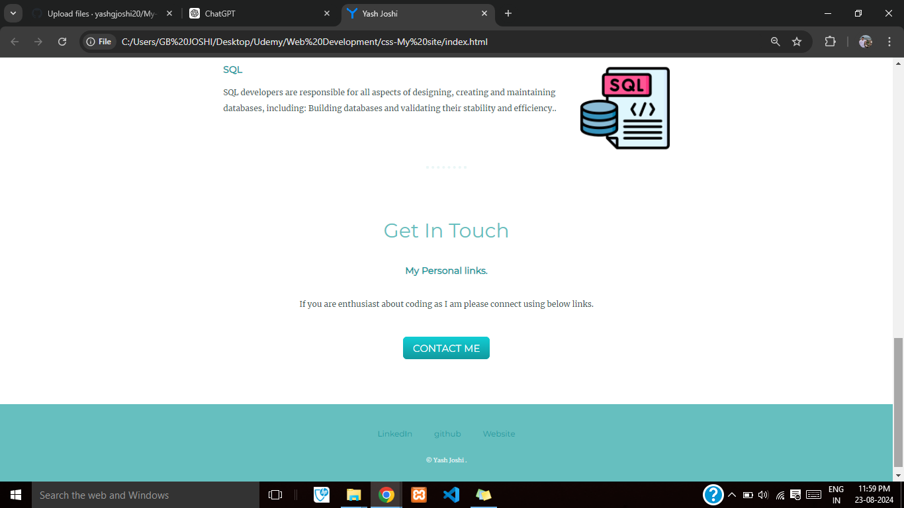

# My-Site - "My Site" is a personal website designed to showcase and share information about Myself. 
This project serves as a digital portfolio, resume, and contact hub, providing visitors with a comprehensive view of [Your Name]’s background, skills, and achievements.

## Screenshots:
### 1- Screenshot-1

### 2- Screenshot-2

### 3- Screenshot-3

### 4- Screenshot-4

### Links

- Solution URL:  [Solution  URL](https://github.com/yashgjoshi20/My-Site.git)
- Live Site URL: [GitHub Pages Live URL]( https://yashgjoshi20.github.io/My-Site/)

### Built with

- Semantic HTML5 markup
- CSS custom properties
- Flexbox
- CSS Grid
- Mobile-first workflow

For the website I've used the following resources:
* ***Icons***: [FlatIcons](https://www.flaticon.com/)
* ***Fonts***: [GoogleFonts](https://fonts.google.com/)
* ***Bootstrap***: [Bootstrap](https://getbootstrap.com/)
* ***External Packagers***: [NPM](https://www.npmjs.com/)

 ## Author

- GitHub - Yash Joshi (https://github.com/yashgjoshi20)
